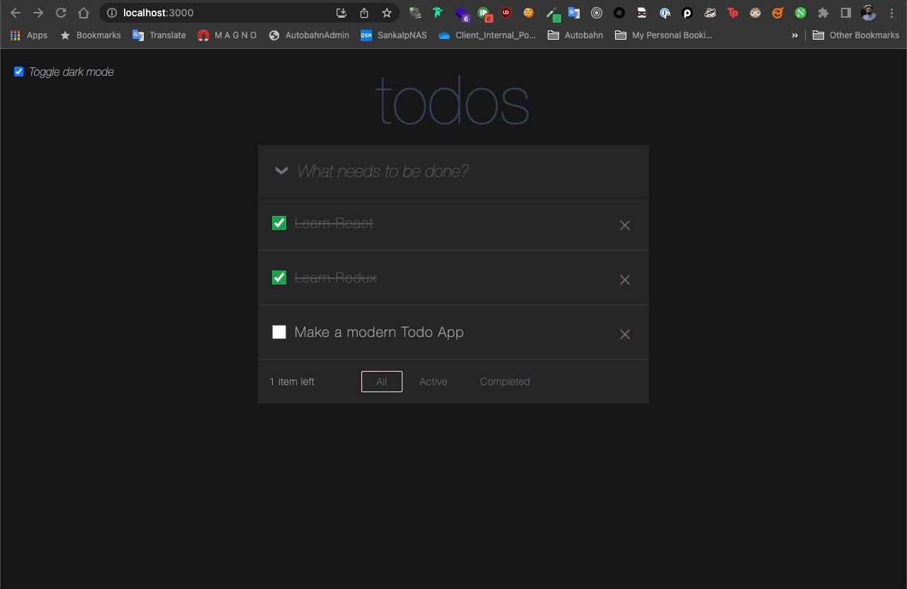

### Demo

# Modern Todo App

This is a modern Todo app built using React, TypeScript, Tailwind CSS, React Query, and Jest for testing. This application allows users to manage their tasks efficiently with a clean and intuitive user interface.

## Features

- Create, edit, and delete tasks
- Mark tasks as complete
- Filter tasks by status (all, active, completed)
- Responsive design for both desktop and mobile devices
- Optimized data fetching with React Query
- Comprehensive test suite with Jest

## Available Scripts

In the project directory, you can run:

### `npm start`

Runs the app in the development mode.\
Open [http://localhost:3000](http://localhost:3000) to view it in the browser.

The page will reload if you make edits.\
You will also see any lint errors in the console.

### `npm test`

Launches the test runner in the interactive watch mode.\
See the section about [running tests](https://facebook.github.io/create-react-app/docs/running-tests) for more information.

### `npm run build`

Builds the app for production to the `build` folder.\
It correctly bundles React in production mode and optimizes the build for the best performance.

The build is minified and the filenames include the hashes.\
Your app is ready to be deployed!

See the section about [deployment](https://facebook.github.io/create-react-app/docs/deployment) for more information.

### Contributing

I welcome contributions to the Modern Todo App! Please follow these steps to contribute:

- Fork the repository on GitHub.
- Clone your fork and create a new branch for your feature or bugfix.
- Commit your changes and push to your fork.
- Open a pull request with a clear description of your changes.

### License

This project is licensed under the MIT License. See the LICENSE file for more information.
